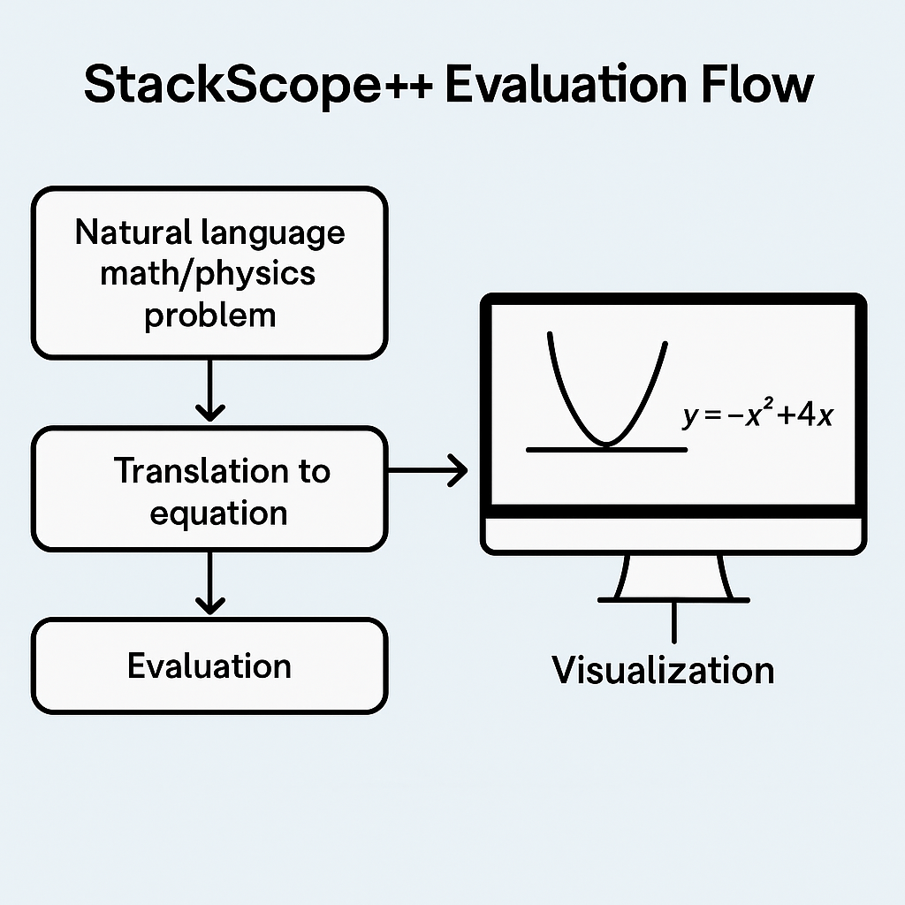

# StackScope++

🧠 A C++ Stack-Based Expression Evaluator with Visual Debugging and AI Expansion Roadmap

## 🚀 Overview

StackScope++ is a high-performance infix-to-postfix expression evaluator using core data structures in C++. It's built to simulate how scientific computing systems process and solve expressions — a perfect blend of DSA fundamentals with a vision for AI and ROOT visualization integration.

> 📌 Built as part of my preparation for CERN, Adobe Hackathons, and Microsoft internship drives.

---

## 🧮 What It Can Do

- ✅ Parse infix expressions like `3 + 4 * (2 - 1)`
- ✅ Convert them into postfix using the Shunting Yard Algorithm
- ✅ Evaluate postfix expressions using a stack
- ✅ Modular design with `main.cpp`, `evaluator.cpp`, and `evaluator.h`

---

## 🔬 Project Vision

- 🔄 Integrate [ROOT by CERN](https://root.cern/) to visualize each stack operation in real-time
- 🧠 Extend with an AI Agent: Convert natural-language math/physics problems into solvable expressions
- 🛠️ Built for students, researchers, and future systems developers in scientific computing

---

## 🧰 Tech Stack

- **Language:** C++
- **Modules:** Custom Expression Parser + Postfix Evaluator
- **Tooling:** ROOT (planned), OpenAI LLM (optional future)
- **Build:** g++, Git, CLI-based testing

---

## 📂 Folder Structure

StackScopePlusPlus/
├── main.cpp # Entry point
├── evaluator.cpp # Stack-based expression logic
├── evaluator.h # Function declarations
├── README.md # Project documentation
├── .gitignore


---

## 📸 Expression Evaluation Flow




---

## 🧪 Sample Test

```bash
g++ main.cpp evaluator.cpp -o evaluate
./evaluate "3 + 4 * (2 - 1)"
# Output: 7
